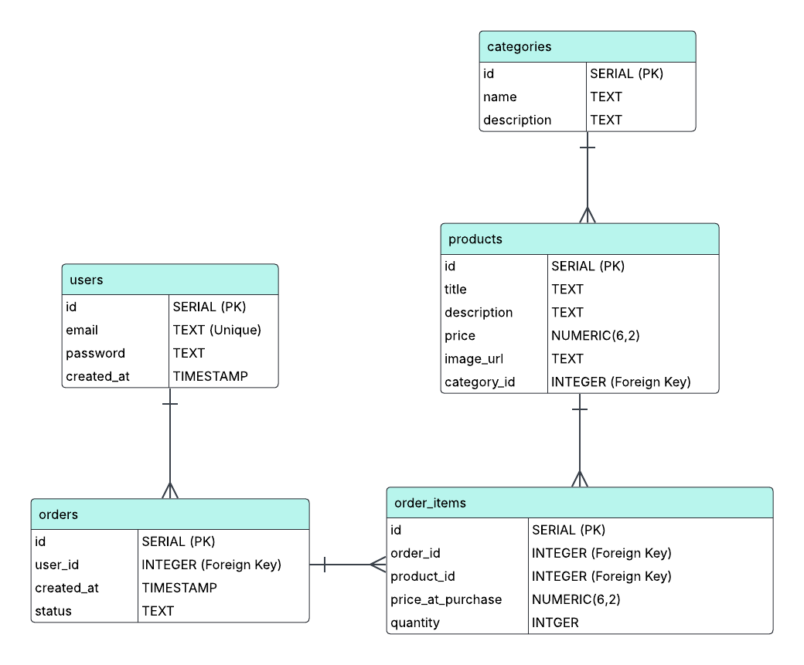

# sticker-webshop-backend

This project is primarily focused on practice and learning, but it may evolve into a fully functional e-commerce platform for selling stickers in the future.

## Database Schema 

This project uses a relational database model. Below is the visual representation of the database schema.

For more detailed information, check the `database-schema.pdf` file located in the `docs/` directory.

## Technoligies used 

- PostgreSQL
- NODE JS
- Express